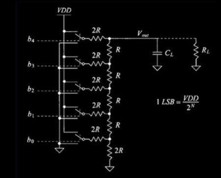
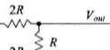
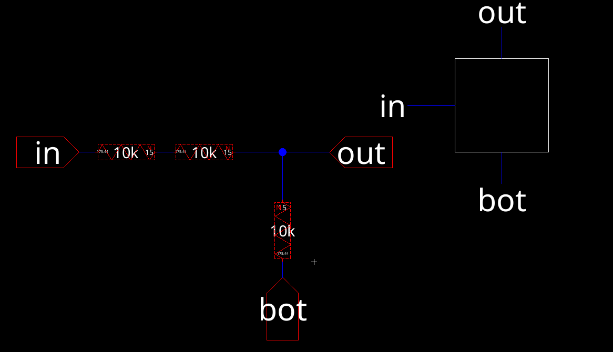
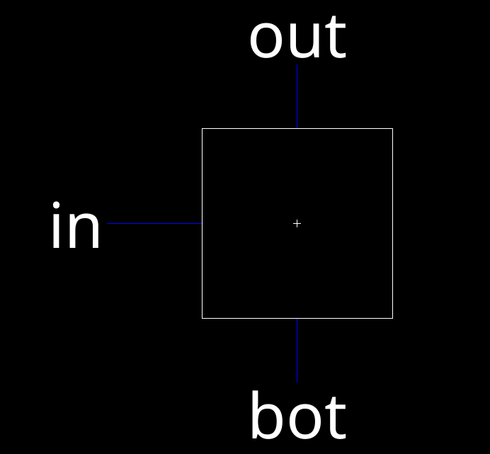
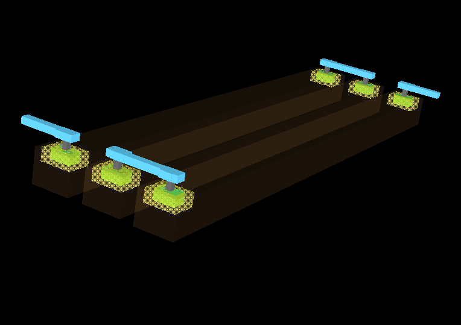
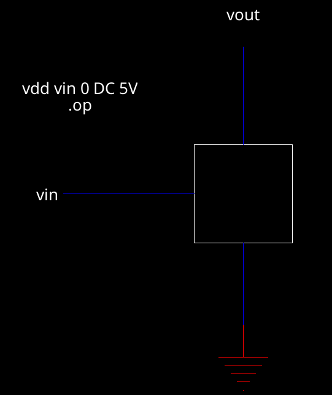
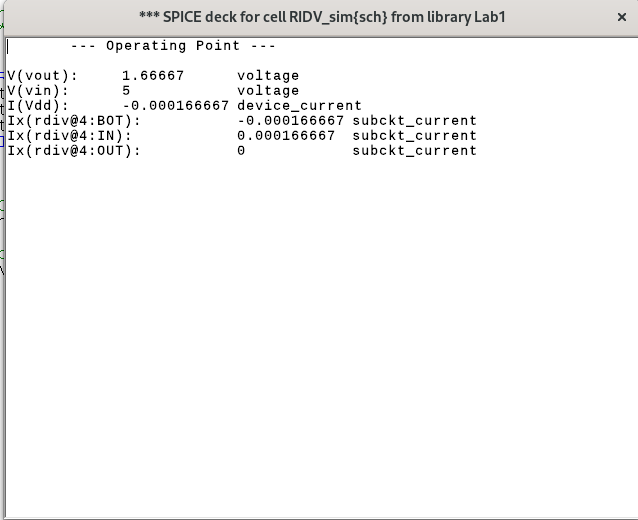
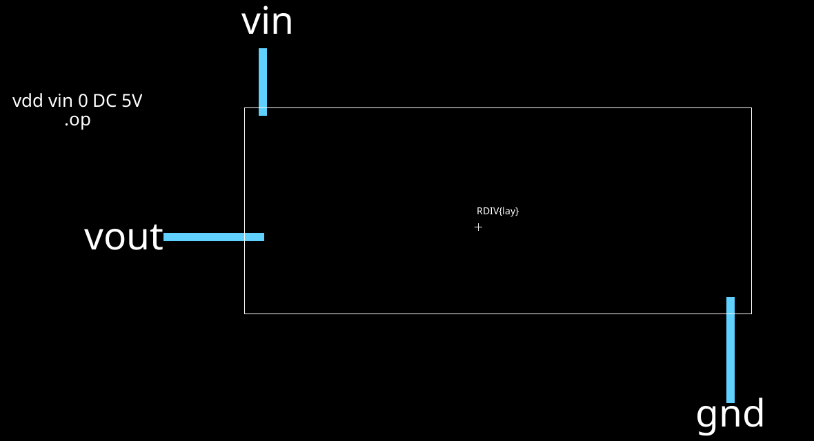
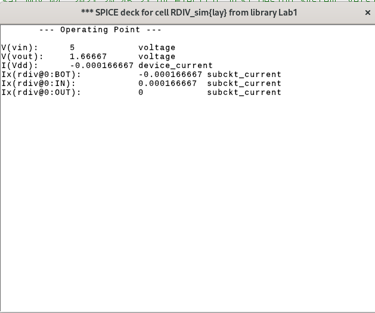

# Lab 1: 5-Bit R2R VLSI

Cade Thornton

10/16/2023

ENCE 3501

## Table of Contents

+ [Introduction](#Introduction )
+ [Voltage Divider](#VoltageDivider)
    * [Schematic](#Schematic)
    * [Layout](#Layout)
    * [Simulations](#Simulations)
+ [5-Bit R2R DAC](#5-BitR2RDAC)
    * [Hand Calc](#HandCal)
    * [Schematic](#Schematic)
    * [Layout](#Layout)
    * [Simulations](#Simulations)
+ [Conclusion](#Conclusion)

## Introduction 
<p align="center">
In this lab, a  virtual 5-bit R2R DAC Circuit is made using Electric VLSI. The design is verified using LTSpice, and consists of a voltage divider resistor IC combined in parallel with other copies of the ic to form the DAC. The layout was made in a similar manner. 
</p>

<p align="center">
  
</p>
<div align="center">
  <p style="font-size: small;">
    Figure 1 (Schematic of R2R Ladder System)
  </p>
</div>


## Voltage Divider

### Schematic

<p align="center"> 
The provided schematic features two resistors. The one linked to the input boasts a resistance that is twice that of the resistor linked to the ground. With a resistance value of 10kΩ for the resistor connected to ground, the one connected to the input exhibits a resistance of 20kΩ.
</p>

<p align="center">
  
</p>

<div align="center">
  <p style="font-size: small;">
    Figure 2 (Schematic of Given Voltage Divider)
  </p>
</div>

<p align="center"> 
An electric VLSI schematic was created from the above schematic, with two 10k ohm resistors replacing 2R
</p>

<p align="center">
  
</p>

<div align="center">
  <p style="font-size: small;">
    Figure 3 (ElectricVLSI Schematic of Voltage Divider)
  </p>
</div>

<p align="center"> 
The schematic generated an icon which was modified to be compact enough to be placed for the DAC
</p>

<p align="center">
  
</p>

<div align="center">
  <p style="font-size: small;">
    Figure 4 (ElectricVLSI Icon of Voltage Divider)
  </p>
</div>

</p>

### Layout 

<p align="center"> 
For the voltage Divider, the layout was made from three n-well resistors with a width of 15 &lambda; and a length of 175.44 &lambda; and the given value of R<sub>sq</sub> = 855 &Omega;/square. Using a width value, the appropriate length was calculated as follows:
</p>

```
10000 = (855)*(L/15)
L = (10000*15)/855
L = 175.44 
```
<p align="center">
Each node was connected to an appropriate input and output using metal contacts
</p>

<p align="center">
  
</p>

<div align="center">
  <p style="font-size: small;">
    Figure 5 (ElectricVLSI Layout of Voltage Divider)
  </p>
</div>

<p align="center">
And here is the 3D view of the layout
</p>

<p align="center">
  
</p>

<div align="center">
  <p style="font-size: small;">
    Figure 6 (ElectricVLSI 3D view of Layout of Voltage Divider)
  </p>
</div>


### Simulations 

------

<p align="center">
  The RDIV schematic was simulated by creating a separate cell group in which the RDIV icon was imported. 5V was passed through the circuit as input, and the expected simulation output was 1.667V.
</p>

<p align="center">
  
</p>

<div align="center">
  <p style="font-size: small;">
    Figure 7 (Voltage Divider Simulation)
  </p>
</div>

<p align="center">
  This is the SPICE Code used for the schematic simulation:
</p>

```
vdd vin 0 DC 5V
.op
```
<div align="center">
  <p style="font-size: small;">
    Figure 8 (Voltage Divider Simulation Spice Code)
  </p>
</div>

<p align="center"> 
  The results of the simulation are shown below, with an output voltage of 1.667V, indidcating that the schematic is correct.
</p>

<p align="center">
  
</p>

<div align="center">
  <p style="font-size: small;">
    Figure 9 (Voltage Divider Schematic Simulation Result)
  </p>
</div>

<p align="center"> 
  The ;ayout was simulated in a similar manner, with an ideal output being 1.667V:
</p>

<p align="center">
  
</p>

<div align="center">
  <p style="font-size: small;">
    Figure 10 (Voltage Divider Layout Simulation)
  </p>
</div>

<p align="center"> 
  These are the results for the layout simulation, showing that a correct output of 1.667V was achieved:
</p>

<p align="center">
  
</p>

<div align="center">
  <p style="font-size: small;">
    Figure 11 (Voltage Divider Layout Simulation Results)
  </p>
</div>

<p align="center"> 
  The resulting NCC check also passed ith no errors:
</p>

<p align="center">
  
</p>

<div align="center">
  <p style="font-size: small;">
    Figure 11 (Voltage Divider Layout Simulation Results)
  </p>
</div>


## 5-Bit R2R DAC

### Hand Calc
### Schematic 
### Layout 
### Simulations 


-------

## Conclusion

------


