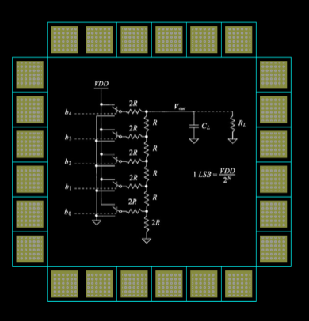

# Lab 2: Padframe with DAC

Cade Thornton

10/23/2023

ENCE 3501

## Table of Contents

-------

+ [Introduction](#Introduction )
+ [Pad Cell](#Link)
    * [Schematic](#Schematic)
    * [Layout](#Layout)
+ [PadFrame](#Link)
    * [Schematic](#Schematic)
    * [Layout](#Layout)
+ [PadFrameDAC](#Link)
    * [Schematic](#Schematic)
    * [Layout](#Layout)
+ [Conclusion](#Conclusion)

## Introduction 

-------

 
The goal of this lab is to create a padframe that contains the 5-bit DAC made previously. The padframe will consist of various subcomponent libraries that will be made over the course of this lab.

  

  

    Figure 1 (Padframe with DAC)
  

## Pad Cell

### Schematic

### Layout 

------

## Pad Frame

### Schematic 

### Layout

-------

## Padframe DAC

### Schematic 
### Layout 

## Conclusion

------

