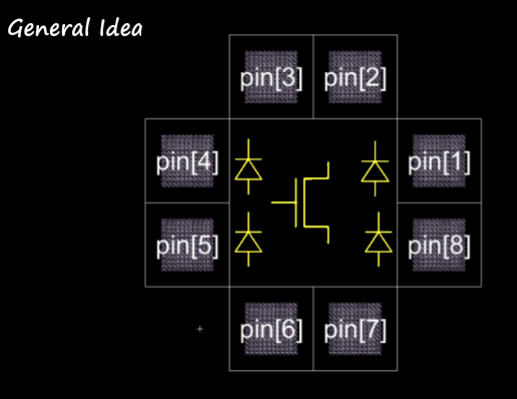

# Lab 3: NMOS with Basic ESD Pad Protection

Cade Thornton

10/30/2023

ENCE 3501

## Table of Contents

-------

+ [Introduction](#Introduction )
+ [ESD Pad Cell](#Link)
    * [Schematic](#Schematic)
    * [Layout](#Layout)
+ [ESD Padfame](#Link)
    * [Schematic](#Schematic)
    * [Layout](#Layout)
+ [Final IC](#Link)
    * [Schematic](#Schematic)
    * [Layout](#Layout)
+ [Conclusion](#Conclusion)

## Introduction 

 
In this lab, the objective is to re-create the padframe from the previous lab, but this time with electrostatic discharge protection that prevents the internal logic from being damaged. The cicuit in the padframe this time will be a simple NMOS transistor instead of a DACc

  

  

    Figure 1 (General Idea of Padframe IC)
  

## ESD Pad Cell

### Schematic

 
The pad cell schematic is essentially an PMOS transistor, with the input connected to a pActive-nWell diode, the ground connected to a pWell-nActive diode, and the export pin of the cell connected between both diodes.

  

  

    Figure 2 (ESD Pad Cell Schematic)
  

 
And this is the generated icon for from the previous schematic.

  

  

    Figure 3 (ESD Pad Cell Schematic Icon)
  

### Layout 

 
Using the existing pWell-nActive and pActive-nWell diode designs, the pad cell layout was constructed. The pad cell is linked to a pActive-nWell diode, which connects to a metal one contact designated as the voltage output. For grounding, the pWell-nActive diode is tied to the pad cell and then to a contact that bridges metal one and metal two layers. This setup leads to a metal two layer that stretches to an additional metal one contact, serving as the ground output. Moreover, the metal two layer that connects to the pWell-nActive diode is strategically placed to cross over the voltage bus in the overall padframe design. Positioned on the metal two layer, the input/output pin connects the two diodes within the pad cell's architecture.

  

  

    Figure 4 (ESD Pad Cell Layout)
  

 
Here is a 3D view to better see how the diodes are connected

  

  

    Figure 4 (ESD Pad Cell Layout)
  

------

## ESD Padframe

### Schematic 

 
Next, we can use the pad cell icon to constuct the padframe in a similar manner to the previous lab, with eight exports connected to a bus (pin[1] - pin[8]) to accomodate the NMOS transistor's four outputs and four inputs.

  

  

    Figure 5 (ESD Pad Frame Schematic)
  

 
And the correspoding icon from electricVLSI:

  

  

    Figure 6 (ESD Pad Frame Schematic Icon)
  

### Layout 

The padframe layout was made using eight of the cell layouts used previusly with ESD protection. A bus is used to connect the ground and voltage for each cell. 

  

  

    Figure 7 (ESD Pad Frame Layout)
  

And here is the 3D view of the padframe layout

  

  

    Figure 8 (ESD Pad Frame Layout in 3D)
  

## Final IC

### Schematic 

### Layout 

-------

## Conclusion

------

