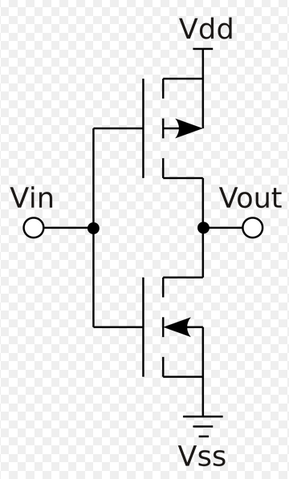

# Lab 4: Inverter

Cade Thornton

10/28/2023

ENCE 3501

## Table of Contents

-------

+ [Introduction](#Introduction )
+ [Inverter 1](#Inverter1)
    * [Schematic](#Schematic)
    * [Layout](#Layout)
    * [Simulations](#Simulations)
+ [Inverter 2](#Inverter2)
    * [Hand Calc](#HandCal)
    * [Schematic](#Schematic)
    * [Layout](#Layout)
    * [Simulations](#Simulations)
+ [Conclusion](#Conclusion)

## Introduction 

-------

The purpose of this lab is to utilize NMOS, PMOS, NWELL and PWELL standard library components to construct a CMOS inverter of various sizes.

  

  

    Figure 1 (CMOS Inverter Schematic)
  

## Inverter 1

### Schematic

### Layout 

### Simulations 

------

## Inverter 2

### Hand Calc
### Schematic 
### Layout 
### Simulations 

-------

## Conclusion

------

