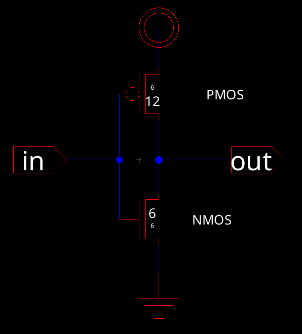
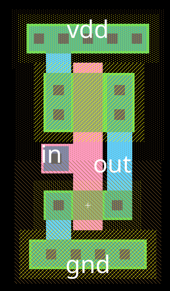
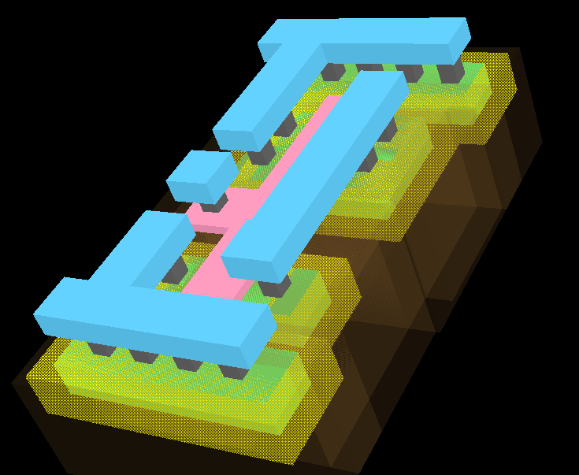
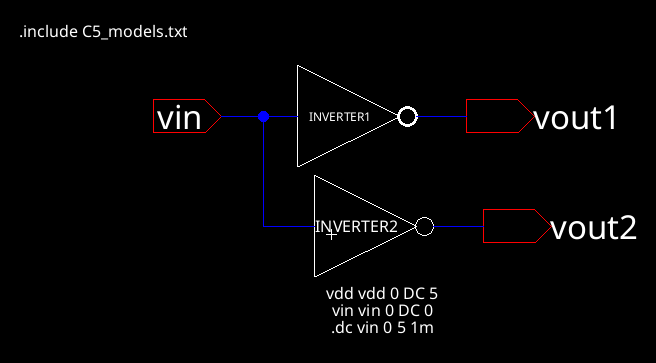

# Lab 4: Inverter

Cade Thornton

10/28/2023

ENCE 3501

## Table of Contents

-------

+ [Introduction](#Introduction )
+ [Inverter 1](#Inverter1)
    * [Schematic](#Schematic)
    * [Layout](#Layout)
    * [Simulations](#Simulations)
+ [Inverter 2](#Inverter2)
    * [Schematic](#Schematic)
    * [Layout](#Layout)
    * [Simulations](#Simulations)
+ [Conclusion](#Conclusion)

## Introduction 

-------

The purpose of this lab is to utilize NMOS, PMOS, NWELL and PWELL standard library components to construct a CMOS inverter of various sizes.

  

  

    Figure 1 (CMOS Inverter Schematic)
  

## Inverter 1

### Schematic

Below is the electricVLSI schematic of the first inverter. It is necessary to make the PMOS transistor larger than the NMOS (PMOS is 12 by 6 while the NMOS is 6 by 6)

  

  

    Figure 2 (CMOS inverter 1 schematic)
  

And here is the generated icon from electricVLSI

  

  

    Figure 3 (CMOS inverter 1 schematic icon)
  

### Layout 

Below is the created layout, which has been constructed in accordance with the schematic, utilizing the NMOS and PMOS provided by the standard library. The PMOS is tied to an nWell that serves as vdd, while the NMOS links to a pWell that functions as the ground. The connection of the NMOS and PMOS follows the design outlined in the schematic.

  

  

    Figure 4 (CMOS inverter 1 layout)
  

Here is a 3D view of the layout which demonstrates the pWell and nWell connections

  

  

    Figure 5 (CMOS inverter 1 layout 3D view)
  

### Simulations 

The spice code applies 5V across the inverter for a duration of 1ms in the initial simulation of Inverter 1, which is aimed at evaluating the inverter's switching threshold. The optimal switching point for the inverter is expected to be at half of vdd.

  

  

    Figure 6 (CMOS inverter 1 simulation)
  

The waveform for the results of the simulation is shown below. The simulation results were deemed successful as the switching point occurred at 2.416V, which is approximately half of vdd, given that vdd was 5V. 

------

## Inverter 2

### Schematic 
### Layout 
### Simulations 

-------

## Conclusion

------

