# Lab #5: Full Adder

Cade Thornton

11/3/2023

ENCE 3501

## Table of Contents

-------

+ [Introduction](#Introduction )
+ [NAND](#NAND)
    * [Schematic](#Schematic)
    * [Layout](#Layout)
    * [Simulations](#Simulations)
+ [NOT](#NOT)
    * [Schematic](#Schematic)
    * [Layout](#Layout)
    * [Simulations](#Simulations)
+ [XOR](#XOR)
    * [Schematic](#Schematic)
    * [Layout](#Layout)
    * [Simulations](#Simulations)
+ [Full Adder](#FullAdder)
    * [Schematic](#Schematic)
    * [Layout](#Layout)
    * [Simulations](#Simulations)
+ [Conclusion](#Conclusion)

## Introduction 

-------

<p align="center">
The purpose of this lab is to utilize NMOS, PMOS, NWELL and PWELL standard library components to construct a CMOS inverter of various sizes.
<p>

<p align="center">
  
</p>

<div align="center">
  <p style="font-size: small;">
    Figure 1 (Schematic of the Full Adder)
  </p>
</div>


## NAND

### Schematic

<p align="center">
The schematic for the NAND gate is shown below. It is fairly simple with two NMOS transistors and a pull-down network"
<p>

<p align="center">
  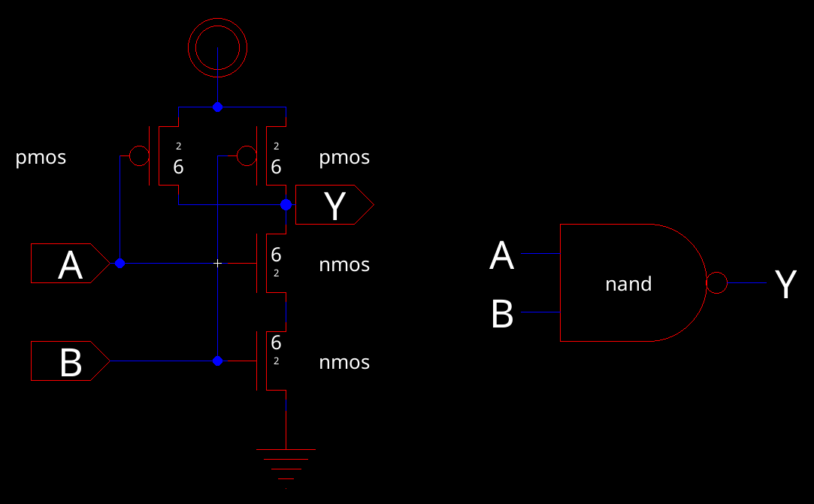
</p>

<div align="center">
  <p style="font-size: small;">
    Figure 2 (Schematic of the NAND gate)
  </p>
</div>

<p align="center">
And this is the corresponding icon generated from electricVLSI, with some custom art styles
<p>

<p align="center">
  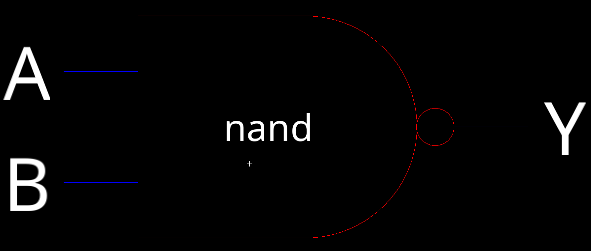
</p>

<div align="center">
  <p style="font-size: small;">
    Figure 3 (Schematic icon of the NAND gate)
  </p>
</div>


### Layout 

<p align="center">
Utilizing NMOS and PMOS from the standard library, the layout has been constructed. The PMOS links to an nWell, designated as vdd, while the NMOS connects to a pWell, identified as ground. As per the schematic, the NMOS and PMOS have been interconnected. Figure 5 displays a screenshot of this layout.
<p>

<p align="center">
  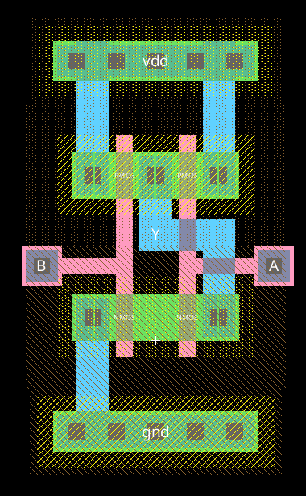
</p>

<div align="center">
  <p style="font-size: small;">
    Figure 4 (Layoutof the NAND gate)
  </p>
</div>

<p align="center">
And here is the corresponding 3D layout of the NAND gate
<p>

<p align="center">
  
</p>

<div align="center">
  <p style="font-size: small;">
    Figure 5 (Layoutof the NAND gate)
  </p>
</div>

<p align="center">
And here is the corresponding 3D layout of the NAND gate
<p>

<p align="center">
  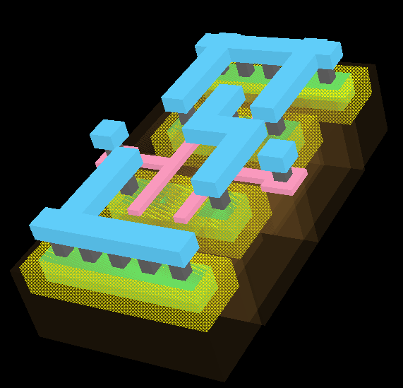
</p>

<div align="center">
  <p style="font-size: small;">
    Figure 6 (3D Layoutof the NAND gate)
  </p>
</div>


### Simulations 

<p align="center">
The initial simulation evaluates the NAND gate's switching point. Ideally, this point for an inverter lies at half of vdd. In the simulation, the SPICE code applies a constant 5V to one input and a pulse wave ranging from 0V to 5V to another. The resulting transient response is subsequently recorded.
<p>

<p align="center">
  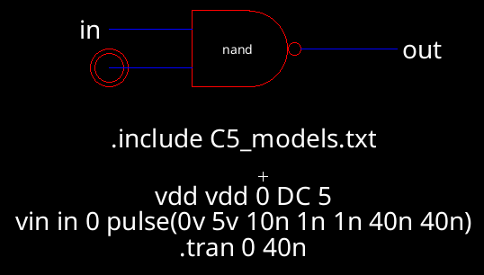
</p>

<div align="center">
  <p style="font-size: small;">
    Figure 7 (NAND gate schematic simulation)
  </p>
</div>

<p align="center">
  The spice code for the schematic is given below:
</p>

```
vdd vdd 0 DC 5
vin in 0 pulse(0v 5v 10n 1n 1n 40n 40n)
.tran 0 40n
```

<div align="center">
  <p style="font-size: small;">
    Figure 8 (NAND gate schematic simulation SPICE code)
  </p>
</div>

<p align="center">
  The resulting waveform is shown below. Vin is half of Vout, indicating a correct switching point was achieved.
</p>

<p align="center">
  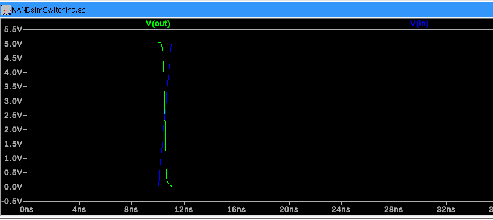
</p>

<div align="center">
  <p style="font-size: small;">
    Figure 9 (NAND gate schematic simulation)
  </p>
</div>

<p align="center">
  For the NAND gate's second simulation, which assesses the behavior of the logic values, the SPICE code administers 5V to vdd. It introduces a pulse wave to both inputs, timing these waves with an offset. This approach allows for observing the relationship between various input combinations and the output. Following this, the transient response is documented.
</p>

<p align="center">
  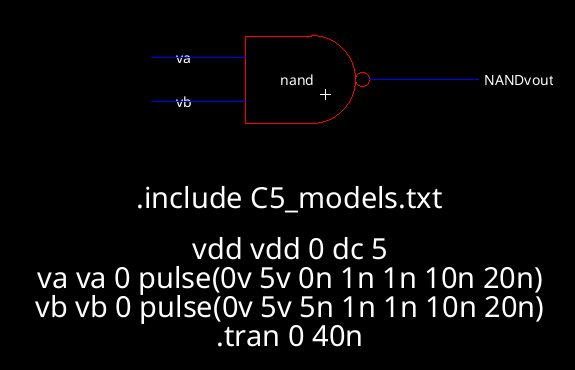
</p>

<div align="center">
  <p style="font-size: small;">
    Figure 10 (NAND gate schematic logic simulation)
  </p>
</div>

<p align="center">
  The resulting waveform demonstrating the correct operation of the NAND gate is shown below
</p>

<p align="center">
  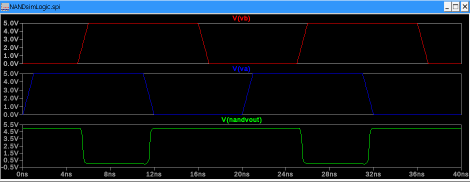
</p>

<div align="center">
  <p style="font-size: small;">
    Figure 11 (NAND gate schematic logic simulation waveform)
  </p>
</div>

------

## NOT

### Schematic 

<p align="center">
 The NOT gate was designed in a similar manner to the NAND gate, but with only a single NMOS and PMOS transistor
</p>

<p align="center">
  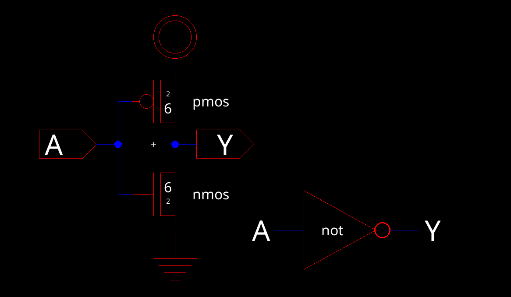
</p>

<div align="center">
  <p style="font-size: small;">
    Figure 12 (inverter gate schematic)
  </p>
</div>

<p align="center">
 And here is the generated icon from the schematic
</p>

<p align="center">
  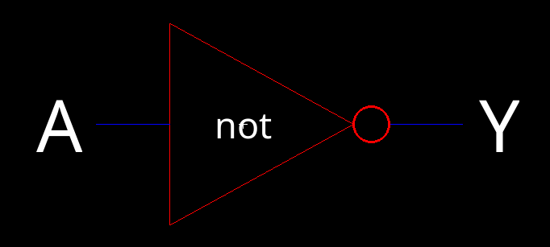
</p>

<div align="center">
  <p style="font-size: small;">
    Figure 13 (Inverter gate schematic icon)
  </p>
</div>


### Layout 

<p align="center">
 Using NMOS and PMOS components from the standard library, the layout was developed. The PMOS connects to an nWell, which is outputted as vdd, while the NMOS links to a pWell, designated as ground. These NMOS and PMOS elements are interconnected following the schematic's guidelines. 
</p>

<p align="center">
  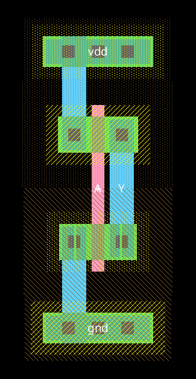
</p>

<div align="center">
  <p style="font-size: small;">
    Figure 14 (Inverter gate layout)
  </p>
</div>

<p align="center">
 And here is a 3D view of the layout:
</p>

<p align="center">
  
</p>

<div align="center">
  <p style="font-size: small;">
    Figure 15 (Inverter gate layout in 3D)
  </p>
</div>

### Simulations 

<p align="center">
 The inverter was simulated in a similar manner to the NAND gate, but only a switching point simulation was done for obvious reasons 
</p>

<p align="center">
  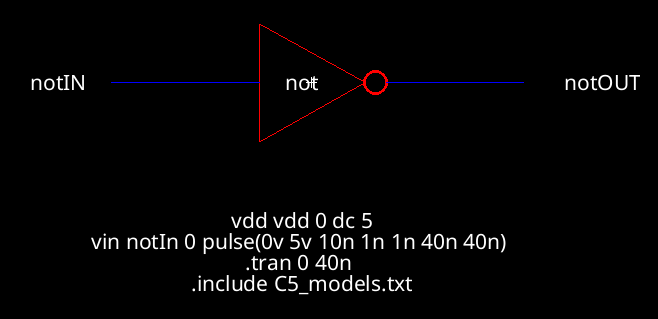
</p>

<div align="center">
  <p style="font-size: small;">
    Figure 16 (Inverter schematic simulation)
  </p>
</div>


-------

## XOR

### Schematic
### Layout 
### Simulations 

------

## Full-Adder

### Schematic 
### Layout 
### Simulations 

-------

## Conclusion

------


