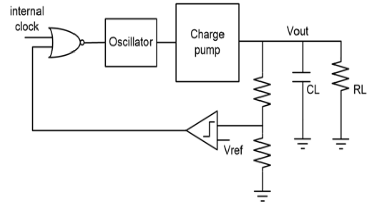
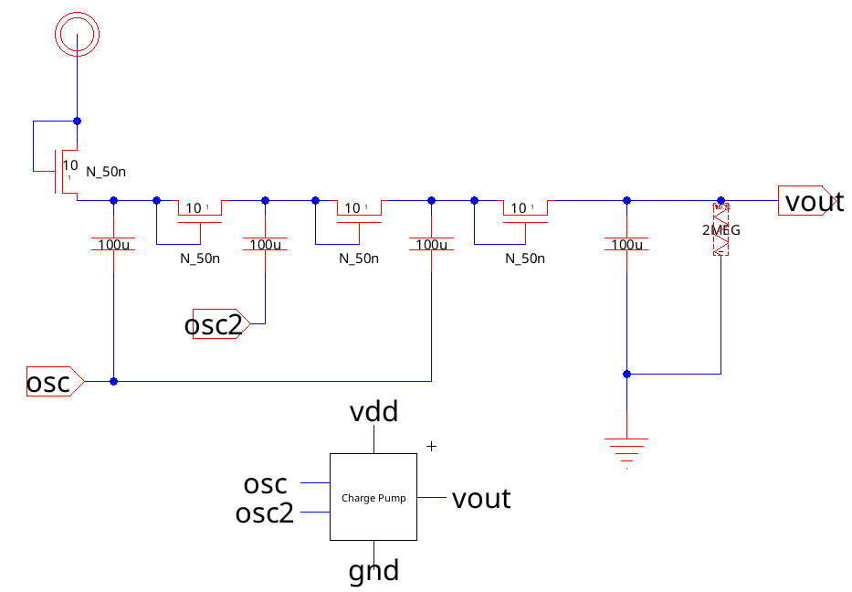
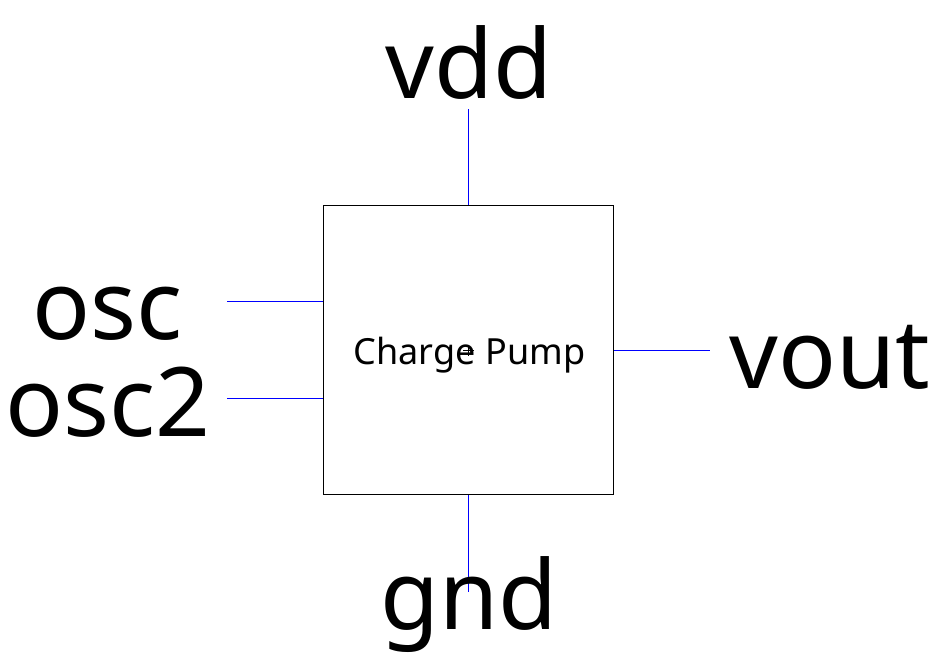
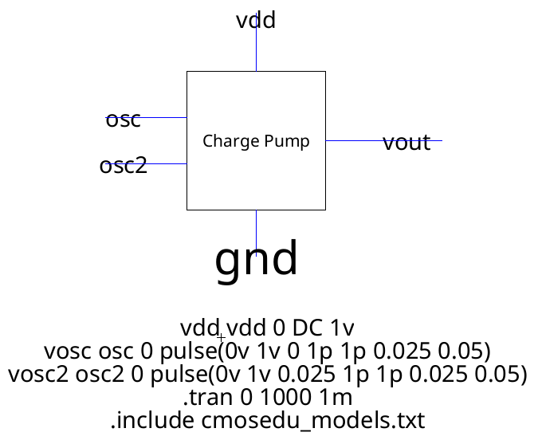
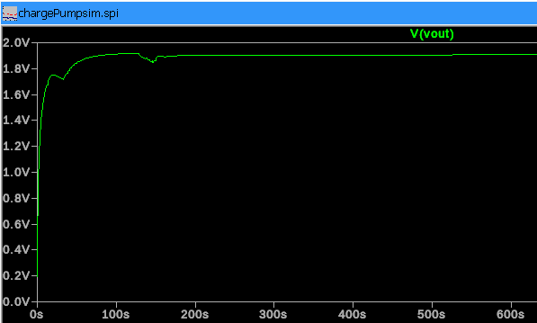

# Lab 6: DC to DC Converter

Cade Thornton

11/14/2023

ENCE 3501

## Table of Contents

-------

+ [Introduction](#Introduction)
+ [Charge Pump](#ChargePump)
    * [Schematic](#Schematic)
    * [Simulations](#Simulations)
+ [Ring Oscillator](#RingOscillator)
    * [Schematic](#Schematic)
    * [Simulations](#Simulations)
+ [Voltage Regulator](#VoltageRegulator)
    * [Schematic](#Schematic)
    * [Simulations](#Simulations)
+ [DC to DC Regulator](#DCtoDCRegulator)
    * [Schematic](#Schematic)
    * [Simulations](#Simulations)
+ [Conclusion](#Conclusion)

## Introduction 

 
The aim of this lab was to design a DC-to-DC regulator using Electric VLSI. However, the lab's scope was limited to detailing the schematics and conducting simulations for the individual components constituting the DC-to-DC regulator. These components comprise a three-stage charge pump, a ring oscillator equipped with an enabling feature, and a voltage regulator functioning as a comparator. The focus on each component's schematic and simulation is critical for understanding the overall functionality and performance of the DC-to-DC regulator in a VLSI environment.

  

  

    Figure 1 (DC-DC regulator Full Schematic)
  

-------

## Charge Pump

### Schematic

 
The initial component developed for the DC-to-DC regulator was a three-stage charge pump. The design of this schematic is such that it ideally produces an output voltage that is three times the input voltage. Given that the input voltage for this particular schematic is set at one volt, the expected output from this three-stage charge pump would be around three volts. This relationship between input and output voltages is a key aspect of the charge pump's functionality within the regulator.

  

  

    Figure 2 (Charge Pump Schematic)
  

 
And here is the corresponding icon generated and then drawn out in a box with the following inputs and outputs to be used later in the project

  

  

    Figure 3 (Charge Pump Schematic Icon)
  

### Simulations 

 
The simulation of the charge pump focuses on evaluating its output voltage. In this simulation, two pulse waves are input into the charge pump, designed to be 90 degrees out of phase with each other. Additionally, the input voltage for the charge pump is set at 1V. The process involves recording a transient of the output, which helps in analyzing the effectiveness of the charge pump in boosting the input voltage under the specified conditions. This transient recording is crucial for understanding how the charge pump performs and for verifying its expected voltage amplification capability.

  

  

    Figure 4 (Charge Pump Schematic Simulation)
  

 
The simulation results for the charge pump were successful in terms of achieving a significant increase in the input voltage. However, the ideal target of achieving a three-volt output was not fully realized. The lower-than-expected output voltage observed in this simulation is likely attributable to voltage losses, which are a common factor in Electric VLSI calculations. To address this issue of low output voltage, one potential solution is to add more stages to the charge pump's circuit. Increasing the number of stages would allow for a greater buildup of voltage over time, potentially bringing the output voltage closer to the desired three volts. This modification could enhance the efficiency and effectiveness of the charge pump in the DC-to-DC regulator design.

  

  

    Figure 5 (Charge Pump Schematic Simulation Waveform)
  

------

## Ring Oscillator

 
For the DC-to-DC regulator, the subsequent component developed was the ring oscillator. This circuit is designed to generate two pulse waves that have a phase offset of 90 degrees from each other. These pulse waves will function as the input for the charge pump. The ideal scenario is that this arrangement will enable the charge pump to operate autonomously, without the requirement for externally simulated inputs. By integrating the ring oscillator in this manner, the charge pump can be effectively driven by a consistent and reliable source of pulse waves, facilitating its performance in boosting the voltage as part of the overall DC-to-DC regulator system.

### Hand Calc
### Schematic 
### Layout 
### Simulations 

-------

## Conclusion

------

